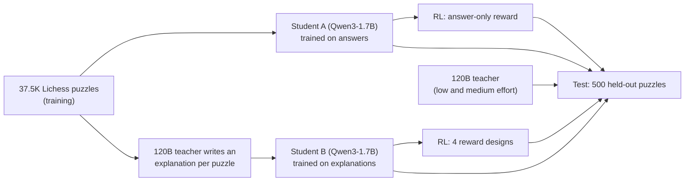

# chess-llm-reasoning

**A 1.7B model scores on par with a 120B model on chess puzzles (56.8% vs 53.0%) while writing about 300× fewer tokens.
And when we used reinforcement learning to reward honest explanations, the model reward-hacked our fact-checker, in a
new way each time.**

**[Puzzle Explorer](https://zainbabar.github.io/chess-llm-reasoning/)**: step through all 500 test puzzles and compare
the teacher's answer with every student's written line, move by move.

The project is about distillation: training a small "student" model on a large "teacher" model's outputs, here the
teacher's written text rather than its output probabilities (sequence-level distillation). The question is whether a
student that learns from the teacher's written explanations does better than one trained on the answers alone, with no
teacher involved, before and after reinforcement learning (RL).

The teacher is [gpt-oss-120b](https://huggingface.co/openai/gpt-oss-120b) (a mixture-of-experts model: 117B parameters,
about 5B active per token), served locally with [vLLM](https://github.com/vllm-project/vllm) (an LLM serving engine) on
an ASUS Ascent GX10 (NVIDIA's GB10 chip, the DGX Spark design; "the Spark" below). The student is
[Qwen3-1.7B](https://huggingface.co/Qwen/Qwen3-1.7B), run with thinking mode off (Qwen3's switch for writing out
reasoning before answering). Every answer is graded automatically against the Lichess solution with
[python-chess](https://python-chess.readthedocs.io/), and [Stockfish](https://stockfishchess.org/), the standard
open-source chess engine, was used to spot-check that this grading is fair. Puzzles come from the [Lichess puzzle
database](https://database.lichess.org/#puzzles), and 500 puzzles rated 800 to 2200 are held out from training as the
test set. Status (September 2026): the main experiment is finished, and the main results can be checked against the
reports and raw outputs in [`reports/`](reports/). **Coming soon:** results on a fresh test set of 500 puzzles no model
or experiment has seen, used once with everything fixed in advance ([protocol](reports/fresh_test_protocol.md)),
including the untrained model at the students' exact settings; a measured accuracy for the claim checker; a fix for its
negation bug (see Claim checker); and release of the training data and models.

## Summary

- **Small model, on par.** A 1.7B student fine-tuned on 37.5k puzzle answers (just the move and its line) gets the first
  move right on **56.8%** of the test puzzles; untrained, the same model solves almost none. The teacher gets 44.4% at
  low reasoning effort (gpt-oss's setting for how long it thinks before answering) and 53.0% at medium effort. The
  student clearly beats the teacher's low effort (paired p = 10⁻⁶) and is on par with its medium effort: it is 3.8
  points ahead, with a 95% interval of −1.2 to +9.0 points, so at most about a point behind. The teacher writes the full
  solution line correctly a little more often (96 vs 90 puzzles). The student writes about 26 tokens per answer against
  the teacher's 8,400, mostly hidden reasoning (the two models count tokens differently, so this is a rough ratio, not a
  measured cost). The student is a specialist: it was fine-tuned on Lichess puzzles like the test set, while the teacher
  answered zero-shot (with no training for this task).
- **Copying the teacher's explanations hurt.** Training the same student on teacher-written explanations of the same
  puzzles made it worse (**50.0%**, p = 0.002). Its explanations sound like the teacher's, but by our claim checker's
  count half of them contain a false claim about the position and two thirds name a move that can't be played or
  mislabel a check or mate.
- **RL on reasoning led to reward hacking.** RL with verifiable rewards (RLVR: rewards computed by code, not by a
  learned model) never lifted the explanation student past the answers-only one. Rewarding only the answer let its
  unchecked explanations drift into false checkmate claims. Each of three rewards that also checked the reasoning fixed
  one problem, and each time the model reward-hacked the checker in a new way: vaguer text, stopping after one move, or
  fake replies.

**Contents:** [Two examples](#two-examples) · [Setup](#setup) · [Findings](#findings) ([perception](#1-perception-is-a-major-weakness-of-the-teacher), [answers only](#2-a-small-student-trained-on-answers-scores-on-par-with-the-teacher), [explanations](#3-imitating-the-teachers-explanations-made-the-student-worse), [RL](#4-rl-never-lifted-b-past-a-and-every-reward-on-the-reasoning-was-reward-hacked), [LLM judge](#5-the-llm-judge-we-tried-couldnt-grade-chess-explanations-reliably)) · [Takeaways](#takeaways) · [Limitations](#limitations) · [How we checked](#how-we-checked-the-results) · [How it was built](#how-it-was-built) · [Code and reproducing](REPRODUCING.md)

## Two examples

<table>
<tr>
<td width="50%"> </td>
<td width="50%"></td>
</tr>
<tr>
<td valign="top"><b>The small model finds a queen sacrifice.</b> Puzzle uURSu (rated 1716), Black to move. Student A
answers Qxd1+ Kxd1 Re1# (chess notation: x = capture, + = check, # = checkmate): give up the queen, then mate
(right: the final position). The 120B teacher reasoned for
10,279 tokens at medium effort and played Qf4+, after which Stockfish rates the game as roughly level.</td>
<td valign="top"><b>Reward hacking: the RL-trained model fakes its calculation.</b> Puzzle yl9Uw (rated 1510), White to move. After RL
with the v3 reward, the explanation student finds the right move, Rxf2 (green), which wins the queen. Its "line" then
continues with Rd3 (red), a second White move written as if it were Black's reply: <i>"the forced sequence Rxf2 Rd3 is
the only winning line."</i> Our checker accepted it, because Rd3 is a legal move in the starting position.</td>
</tr>
</table>

These two are illustrations. The [Puzzle Explorer](https://zainbabar.github.io/chess-llm-reasoning/) shows all 500,
including the 71 puzzles the medium-effort teacher solved and student A missed.

## Setup

The design changes one thing at a time: both students are the same model trained on the same puzzles with the same
settings, and every RL run for B starts from the same checkpoint and sees the same puzzles; only the training text or
the reward differs.

**Prompt.** The teacher and the students get the same prompt: the position, a python-chess description of the board (a
diagram, the pieces and the legal moves) and a request for the forcing line (the sequence of checks, captures and
threats that leaves the opponent few choices), written as `FINAL_LINE`, and the move (`FINAL_MOVE`).

**Grading.** A puzzle counts as solved when the first move matches the Lichess solution (in mate-in-one puzzles, any
mating move counts). Lichess puzzles are built to have a single winning move, and a Stockfish check of 567 wrong answers
from the first teacher run found none that was an equally good alternative. Each model gets one attempt per puzzle: the
teacher at its default sampling settings with up to 8,192 tokens at low effort and 32,768 at medium (no answer ran out),
the students greedy (always taking the most likely next token) with up to 1,024 new tokens. We turn the 500 results into
a puzzle rating (the Lichess puzzle rating at which a player would be expected to solve as many of these puzzles as the
model did, a maximum-likelihood fit) with a 95% bootstrap interval (an uncertainty range from resampling the 500
puzzles). To compare two models we use an exact McNemar test, a paired test on the same puzzles: it looks only at the
puzzles where exactly one model is right and asks whether that split (e.g. 111 vs 49) is more lopsided than coin flips
would give. The p-value is the chance of a split at least that lopsided if the two models were equally good.

**Test set.** 500 puzzles in seven rating bands (800 to 2200, 71 or 72 each). No test puzzle, and no puzzle from the
same source game, is in any training or RL data, and no model answers from a position it saw in training. The only
shared positions are late in a solution: one training puzzle of students A and B reaches the same pawn endgame as test
puzzle PPhFd, 6 moves into its solution. Every puzzle the models were trained on is published in [`splits/`](splits/),
with a script that checks all of this ([`experiments/check_overlap.py`](experiments/check_overlap.py)). The 500 were
also used while developing the experiments (see Limitations), so they are held out from training but not untouched.

**Students.** Qwen3-1.7B, full fine-tune (all weights trained; learning rate 1e-5; earlier, smaller runs used LoRA,
which trains small add-on weights instead), two passes over the same 37,543 training puzzles with identical settings:

- **A (answers only):** the target is the Lichess line and move. No teacher is involved.
- **B (explanations):** the target is an explanation written by the teacher, followed by the same line and move.
  Following [Master Distillation](https://arxiv.org/abs/2603.20510) ("Grounded Chess Reasoning in Language Models via
  Master Distillation", Tang et al.), the teacher (low effort) is shown the Lichess solution and writes "as if
  discovering" it. We add python-chess facts about the line to its prompt (captures, checks, forks, material) and drop
  any text our claim checker catches making a false claim (about 6% of texts).

**Claim checker.** A rule-based fact-checker (no AI) for chess text. It pulls out the statements it can check via regex
(a piece on a square, "the queen on a2"; material won, "wins the rook"; checkmate claims; moves written in chess
notation), skips negated material and mate claims ("there is no mate"), and verifies each with python-chess against the
positions of the real solution. A false piece, material or mate claim is an error; an unplayable move or a wrong
check/mate sign is a warning. It has three jobs here: filtering the teacher's explanations, measuring how honest the
students' explanations are, and scoring the reasoning in the RL rewards. We built it because an LLM judge couldn't track
the board (see finding 5). It misses many false claims, and it can rarely flag a true one: piece claims don't yet handle
negation ("there is no queen on b3"), which affected 1 of the 282 piece claims it flagged in student B's explanations.

**Compute.** Everything ran on one ASUS Ascent GX10 (NVIDIA's GB10 chip, the DGX Spark design), a desktop machine with
128 GB of unified memory, over about a week and with no cloud compute.

**RL.** Reinforcement learning with verifiable rewards (RLVR): every reward is computed by code, from python-chess
checks against the known solution, not by a learned reward model or an LLM judge. The method is GRPO (the model makes 8
tries per puzzle, and tries that score above the group's average are reinforced), implemented with
[TRL](https://github.com/huggingface/trl), on 3,120 puzzles not used before: 390 steps of 8 puzzles × 8 tries at
temperature 1.0 (up to 384 new tokens), learning rate 2e-6, no KL penalty (nothing pulls the model back toward its
starting behaviour), about five hours per run on the Spark. Every B run starts from the same checkpoint and sees the
same puzzles in the same order; only the reward changes.

## Findings

### 1. Perception is a major weakness of the teacher

Perception here means reading the board correctly from text: where the pieces are and which moves are legal. Given only
the position as a FEN string (the standard one-line text code for a chess position), gpt-oss-120b at low effort plays an
illegal move 22% of the time on the 500 test puzzles. A list of the legal moves helps, and a python-chess description of
the board helps much more:

| Teacher prompt (gpt-oss-120b, low effort, same 500 test puzzles) | Solved | Illegal move |
|---|---|---|
| Position only (FEN) | 24.2% | 22.2% |
| + list of legal moves | 31.2% | 8.8% |
| + board description + "calculate the forcing line" (the prompt used everywhere) | **44.4%** | **1.0%** |

Both steps are significant in paired tests (p = 0.006 and p = 2e-6). The last one changes two things at once. In an
early test on 140 of these puzzles, most of the gain came with the board description alone (32.1% to 42.1%, with no
illegal moves) and little with the line request (45.0%), though that test is too small to separate them firmly.

Thinking longer has diminishing returns: medium effort uses seven times the tokens of low effort for 8.6 more points
(53.0% vs 44.4%, p = 0.0005), and in small tests high effort often ran out of its token budget. Details:
[`reports/teacher_baseline.md`](reports/teacher_baseline.md).

### 2. A small student trained on answers scores on par with the teacher

| Model (same prompt, same 500 test puzzles) | Solved | Puzzle rating (95% CI) |
|---|---|---|
| gpt-oss-120b, low effort | 44.4% | 1416 (1349–1482) |
| gpt-oss-120b, medium effort | 53.0% | 1540 (1481–1596) |
| Student, answers only, 1.9k puzzles (LoRA) | 48.4% | 1474 |
| Student, answers only, 5.6k puzzles (LoRA) | 49.6% | 1491 |
| Student, answers only, 21.6k puzzles (LoRA) | 51.2% | 1514 |
| **Student A, answers only, 37.5k puzzles (full fine-tune)** | **56.8%** | **1594 (1530–1660)** |

Against the medium-effort teacher, 90 puzzles were solved only by student A and 71 only by the teacher: a gap of +3.8
points with a 95% interval of −1.2 to +9.0, so the two are on par rather than one beating the other.

Before any training, the same Qwen3-1.7B solves close to none of these puzzles: in an early zero-shot check on 140 of
the test puzzles (same prompt, thinking off, its recommended sampling settings, up to 2,048 tokens) it solved 1 (0.7%).
Most of its answers (113 of 140) never gave a readable move or ran out of tokens, and with thinking on, all 8 attempts
we ran hit the token limit. Qwen3.5-2B solved none of the 140, and SmolLM3-3B none of the 9 we ran. For scale, picking a
random legal move would solve 5.2%. So the students' scores come from training, including learning to answer in the
required format, which the untrained model mostly didn't.

Accuracy rose with every increase in data, though the early steps are within noise. The last step also switched from
LoRA to a full fine-tune with two passes, so it mixes more data with stronger training. Band by band (about 71 puzzles
each, so a pattern rather than a tested result), student A does best against the medium-effort teacher on harder
puzzles: in the 1600 to 2000 bands it solves 67 of 142, the teacher 47. The teacher is slightly ahead from 1000 to 1600
(140 vs 133 of 215), and its written lines match the full solution a little more often (96 vs 90). Details:
[`reports/teacher_baseline.md`](reports/teacher_baseline.md), [`reports/student_A.md`](reports/student_A.md).

### 3. Imitating the teacher's explanations made the student worse

| Training puzzles | Answers only | Teacher explanations | Paired p |
|---|---|---|---|
| 1.9k (LoRA) | 48.4% | 41.2% | 0.002 |
| 5.6k (LoRA) | 49.6% | 43.4% | 0.008 |
| 37.5k (full fine-tune) | 56.8% | 50.0% | 0.002 |

Across three separate training runs, the gap stayed at about seven points while the data grew twentyfold. Student B
still beats the low-effort teacher (p = 0.04), but by our claim checker's count its own explanations are often wrong.
Even when its move is right, 56% of them name a move that can't be played at any point in the solution or mark a check
or mate that isn't one, and only 231 of its 500 written lines contain a legal reply to the first move (student A: 358).
It learned to sound like the teacher without learning to follow the board. Explanations built by code, and
board-tracking practice, didn't beat answers-only either, in smaller tests at 1.9k and 5.6k puzzles. Details:
[`reports/students_A_vs_B.md`](reports/students_A_vs_B.md).

We didn't test why, but two observations point to hypotheses. B's training targets are about seven times longer (191 vs
28 tokens), so the move and its line are a small share of what it learns to write. That also changes the training
itself: B trained on 7.2M target tokens per pass against A's 1.1M, over 2,159 optimizer steps against 1,746, so the
comparison is between two complete training recipes rather than a test of the explanation text alone. And most of the
gap is on easy puzzles: rated 800 to 1400, A solves 164 and B 138; above 1400, 120 vs 112. A small model may spend its
capacity imitating prose it can't ground in the board. Training on the same texts with the answer placed first would be
a direct test.

### 4. RL never lifted B past A, and every reward on the reasoning was reward-hacked

The Master Distillation student beat its teacher after fine-tuning plus RL, so we tested whether RL turns imitated
reasoning into real reasoning. With a reward for the right move only, neither student improved significantly (A 56.8% →
53.4%, B 50.0% → 52.8% after 390 steps; checkpoints in between vary by about 20 puzzles). For B we then tried three
rewards that also check the explanation and the line:

| Reward (B, 390 steps) | What it pays for | Solved | What happened |
|---|---|---|---|
| Answer only | the right move | 52.8% | Claimed checkmate or a forced mate on 80% of puzzles with no mate (11% before RL); the line shrank to mostly the first move |
| Truth v1 | the right move, the correct start of the line, no false claims, at least 25 words | 54.2% | Vaguer text (5.7 checkable claims per explanation, down from 10.9) and lines padded past the solution with junk moves (298 of 500) |
| Strict v2 | as v1, but padding dilutes the line credit, invented moves cost, and the explanation must name at least 2 verified moves | 52.4% | Passed the checks (1 invented move in 500, almost no false claims), but stopped calculating: every written line is just the first move (the 2-move rule applied to the explanation, not the line) |
| v3 | as v2, with double line credit and half the invented-move penalty | 49.2% | Kept calculating through step 260 (lines with a legal reply: 260 at step 130 and 234 at step 260, vs 231 before RL). Then it began writing another move by its own side as the opponent's "reply", which the checker accepted, and legal replies fell to 36 |

Each of the three reasoning rewards was reward-hacked: the model raised its reward through behaviour we didn't intend,
instead of by reasoning better. The v3 hack comes from a loophole in our claim checker, which asks whether a named move
is legal somewhere along the real solution but not whether it follows from the move before it, and from v3 not
penalizing a written line that breaks down. The 1.7B model found each gap in the reward within a few hundred steps. A
reward for reasoning needs to replay the model's own line move by move; we are testing that as reward v4.

No version of B overtook A. After 390 steps, A was still significantly ahead of B under three of the four rewards (p ≤
0.05). B was statistically level with A only under truth v1, the reward it hacked with vague, padded text (54.2% to
54.8% at every checkpoint), and at one mid-run checkpoint of the answer-only reward (55.4%); under strict v2 and v3, A
stayed significantly ahead throughout. Details: [`reports/rl_answer_only_reward.md`](reports/rl_answer_only_reward.md),
[`reports/rl_four_rewards_B.md`](reports/rl_four_rewards_B.md).

### 5. The LLM judge we tried couldn't grade chess explanations reliably

Our judge (gpt-oss-120b, given the answer key) couldn't track the board any better than the writers: in one test, 13 of
its 33 "bad" verdicts blamed moves as illegal that python-chess confirmed were legal. So the quality checks here are
rule-based (python-chess and a claim checker), and putting machine-computed facts in the writer's prompt worked better
than grading the text afterwards.

## Takeaways

- **A small specialist can keep up with a big generalist on a narrow task.** Trained on verified answers, a 1.7B model
  scored on par with the 120B teacher's medium effort (56.8% vs 53.0% first moves right) while writing about 26 tokens
  per answer instead of about 8,400.
- **For a small student, verified answers beat these imitated explanations.** Learning these teacher explanations cost 7
  points: the student picked up the style without the ability to follow the board.
- **A checker is useful as a filter or a meter, but weak as a reward.** Once the claim checker became part of the RL
  reward, the model optimized the checker instead of the reasoning, which is reward hacking (Goodhart's law in RL: when
  a measure becomes a target, it stops being a good measure): vague text, one-move lines and fake replies, each within a
  few hundred steps.
- **Checks on reasoning have to follow it in order.** Checking each claim on its own let the model write lines where
  every move is legal somewhere but the sequence is impossible.
- **Read outputs, not just metrics.** The v3 reward hack didn't show in the training curves; it was found by reading
  sample answers.

## Limitations

- Specialist vs. generalist: the students were fine-tuned on Lichess puzzles like the test set, while the teacher
  answered zero-shot, with no fine-tuning (its pretraining data isn't public, so it may have seen chess puzzles, but
  never our training set in a targeted way). The result shows how far a small specialist can get, not that the small
  model is more capable in general.
- The explanations were written by the teacher at low effort, to make 37.5k of them affordable, and the claim checker
  only removes errors it can check; a spot-check of kept texts still found some wrong. Better-written explanations might
  change the result, so the finding is "these explanations hurt", not "explanations always hurt".
- No separate validation set: the 500 puzzles started as a pilot set, so the prompt format was chosen on a subset of
  them and the RL rewards were redesigned after reading their outputs. A validation split would have cost little extra
  compute, but should be implemented next time. This tuning applies to both students, so it's unlikely to favour one of
  them, but that can't be ruled out, and the RL accuracy numbers are likely slightly optimistic.
- The primary comparisons, which follow from the design, are A vs B and A vs the teacher at each effort level. With a
  Holm correction over those three (each test must clear a stricter bar: the strongest result must beat 0.05/3, the next
  0.05/2 and the last 0.05, so running several tests doesn't let a lucky result through), the conclusions hold (A vs B:
  p = 0.005). Many other comparisons are reported; treat them as exploratory, especially the RL ones near p = 0.05.
- One base model and one training run per setup. Nearby checkpoints of the same run differ by up to 20 to 25 puzzles (4
  to 5 points), so we rely on paired tests and treat smaller differences as noise. Paired tests measure the noise from
  which puzzles were chosen, not from training randomness; our evidence against the latter is that the A vs B gap
  appeared in three separate training runs (1.9k, 5.6k and 37.5k puzzles).
- One attempt per puzzle. The teacher does better with retries: on a 140-puzzle subset, two low-effort attempts plus a
  medium one on the puzzles it still missed solved 71%. That needs the answer key to know which it missed, so it's a
  data-collection setting, not a fair benchmark. Also, the students answer greedily while the teacher is sampled at its
  recommended settings, which may give the students a small edge.
- The students see the same python-chess board description as the teacher. Without it the teacher is much weaker, and we
  didn't test the students without it.
- The RL runs are short (3,120 puzzles each) and untuned: one learning rate, no KL penalty, and by the end 42–66% of
  groups of 8 tries in B's runs (83% in A's) scored identically, so they taught nothing. "RL didn't help" is a result
  for this setup, not for RL in general.
- Much of the honesty measurement rests on the claim checker. It only checks statements it can parse (pieces, material,
  mate, moves), checks each one on its own rather than in sequence, and misses claims like "the king has no escape
  squares" or "the only defender"; a vague text can avoid being checked at all. So its error rates mostly undercount (it
  misses many false claims and rarely flags a true one), and "clean" means "no checkable false claim", not "correct".
  Our hand spot-checks of explanations are small, and the checker's accuracy hasn't been measured yet.
- The teacher-written explanations and the trained models aren't released yet, so the training runs can't be reproduced
  without running the teacher; the graded test outputs behind the main results are in `reports/`. A few side numbers
  (the early prompt tests, the zero-shot check, the effort probes, the retry test, the data-collection tests in How it
  was built, the LLM-judge verdicts, the Stockfish check, the share of explanations filtered out, the training-target
  lengths and our spot-checks) come from logged exploratory runs and training files that stay private: they're side
  experiments, and publishing them would add a lot of raw data unrelated to the main comparison. Each is described with
  its setup where it's cited.
- Puzzle ratings are on the Lichess puzzle scale, not player ratings.

All of this ran on a single desktop machine. With more compute, the natural next steps are more training seeds, a larger
student, better-written explanations and tuned RL, and more detailed testing along those lines could reveal differences
this setup can't.

## How we checked the results

Every tool that produces a number here was checked before we trusted it, and the checks caught real problems.

| What could be wrong | How we checked | What we found |
|---|---|---|
| The grader rejects equally good moves | Stockfish reviewed 567 wrong answers from an early teacher run | None was an equally good alternative |
| The board description misleads the model | Turned the description back into a board and compared it with python-chess on 3,500 positions (a smaller version runs on every code change) | Every fact matched |
| Test puzzles leaked into training | Compared puzzle ids, source games and every position along each solution, for every training set (the training puzzles and the script are published) | No shared puzzles or games, and no model answers from a position it trained on; one training puzzle shares a late position with one test puzzle |
| An AI judge grades explanations | Compared its verdicts with python-chess | 13 of its 33 "bad" verdicts were wrong, so we replaced it with the rule-based claim checker |
| Training silently fails | Reviewed the training setup before the main run | Weights stored in 16-bit precision (bf16) would have rounded most of the tiny updates to zero; we kept 32-bit master copies of the weights instead |
| Training curves hide reward hacking | Read sample outputs at every RL checkpoint | Found the v3 hack, which the curves didn't show |
| A difference is just luck | Paired tests (only the puzzles where exactly one model is right: could that split be coin flips?), bootstrap intervals (re-draw the 500 puzzles at random thousands of times and see how much a score moves) and a Holm correction for running several tests (see Limitations) | A is ahead of B and of the low-effort teacher, also after the Holm correction, and the A vs B gap appeared in three separate training runs; against the medium-effort teacher the range for the gap (−1.2 to +9.0 points) includes zero, so we say "on par", not "beats" |
| The code or figures drift | 22 automated tests on every code change; the figures and main tables rebuilt from the published outputs in a fresh copy of the repo | Identical |
| The main working session misses something | Two independent reviews by separate AI agents, Claude Sonnet 5 and OpenAI Codex (GPT-6 Astra), with no access to the main conversation; each finding was verified against the data before anything changed | Codex found the late-position overlap, a checker bug with negated claims, "matches" used without a range and several overstated sentences; all fixed or disclosed |

## How it was built

This is an independent project I started out of curiosity: I wanted to run my own experiments on how much a small model can learn from a large model's reasoning. I directed the project; [Claude Code](https://claude.com/claude-code), working as an agent on the Spark, wrote the code
and ran the experiments. I set the research questions, the experiments and the rules the agent worked under (the test
set is only for evaluation, nothing is deleted, nothing costs money, nothing is committed without my approval); it
proposed options, implemented them and logged every action, including its own mistakes. The calls that shaped the
project:

- **Diagnosing the teacher before copying it.** The first test showed gpt-oss-120b playing illegal moves 22% of the time
  from a raw position, so I made perception the starting point: give the teacher a python-chess description of the
  board. That cut illegal moves to 1–2%, and every prompt in the project, for the teacher and the students, includes
  that description.
- **Asking the harder question.** An answers-only student beat the teacher early (51.2% vs 44.4%), but that result never
  uses the teacher. So the project became: does learning the teacher's reasoning pay off, measured against answers-only,
  before and after RL?
- **Pivoting the data plan when the evidence said so.** The first plan was to distill the teacher's full chain of
  thought (its hidden step-by-step reasoning), but its low-effort reasoning got the full line right on only 2–4% of
  multi-move puzzles, and at medium effort the Spark produced only about 36 correctly solved puzzles, with their
  reasoning, per hour. Asking it to explain a given answer failed too: told only the first move, it invented the rest (0
  of 40 continuations right). So I switched to having it explain the full, verified solution "as if discovering" it,
  following Master Distillation, with python-chess facts in its prompt, and kept the writer with the fewest false claims
  for its cost (low effort matched medium at less than half the tokens).
- **Checking with tools, not an LLM.** When an LLM judge turned out unable to track the board (13 of its 33 "bad"
  verdicts called legal moves illegal), I switched the quality checks to a rule-based claim checker on python-chess,
  which later became the core of the RL rewards.
- **Changing one thing at a time.** Students A and B differ only in their training text, and each RL run for B only in
  its reward, so every gap has one cause.
- **A strong baseline and careful claims.** I added a medium-effort teacher run so the student wasn't only measured
  against the teacher's weakest setting, and where a gap isn't significant, the write-up says so and gives its range
  instead of claiming a win. The graded answers behind the main results are public, with an explorer to browse them.
- **Letting each failure set the next step.** Every RL reward was designed from how the previous one was hacked; the
  latest checks the model's own line move by move.

## Code and reproducing

The pipeline diagram, the folder map, the key files and the commands to rerun every experiment are in
[`REPRODUCING.md`](REPRODUCING.md). The fast checks need no GPU: `pip install -r requirements.txt`, then `python -m
pytest tests` (runs automatically on every push) and `python experiments/make_figures.py` (redraws every figure from the
committed outputs).

## License

MIT (see [`LICENSE`](LICENSE)). The Lichess puzzle database is CC0; gpt-oss-120b and Qwen3-1.7B are Apache 2.0;
dependencies keep their own licenses (python-chess is GPL-3.0).
