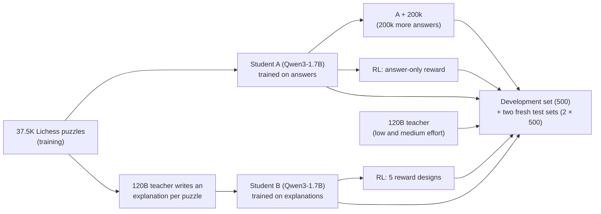

# chess-llm-reasoning

**A 1.7B model trained on verified puzzle answers beats a 120B model on chess puzzles it has never seen: 63.3% vs 52.8%
first moves right on 1,000 untouched puzzles, while writing about 300× fewer tokens. Trained on the 120B model's own
explanations instead, it did worse. And when we used reinforcement learning to reward honest explanations, the model
reward-hacked our fact-checker, in a new way each time.**

*Puzzle ratings on the development set (the first 500 test puzzles), for the teacher and the two main students.*

**[Puzzle Explorer](https://zainbabar.github.io/chess-llm-reasoning/)**: an interactive site for the development-set
results: step through all 500 puzzles and compare the teacher's answer with each student's written line, move by move.
It doesn't yet include the newer models (A + 200k, reward v4) or the fresh test sets.

The project is about distillation: training a small "student" model on a large "teacher" model's outputs, here the
teacher's written text (sequence-level distillation; [Kim & Rush, 2016](#references)) rather than its output
probabilities (the original form of distillation; [Hinton et al., 2015](#references)). The question is whether a student
that learns from the teacher's written explanations does better than one trained on the answers alone, with no teacher
involved, before and after reinforcement learning (RL).

The teacher is [gpt-oss-120b](https://huggingface.co/openai/gpt-oss-120b) served locally with
[vLLM](https://github.com/vllm-project/vllm) on an ASUS Ascent GX10 (NVIDIA GB10, the DGX Spark design). The student is
[Qwen3-1.7B](https://huggingface.co/Qwen/Qwen3-1.7B), run with thinking mode off. Every answer is graded automatically
against the Lichess solution with [python-chess](https://python-chess.readthedocs.io/), and
[Stockfish](https://stockfishchess.org/) was used to check that this grading is fair. Puzzles come from the
[Lichess puzzle database](https://database.lichess.org/#puzzles).

**Status** (October 2026): the experiments are finished. The results were developed on 500 held-out puzzles (the
*development set*) and then confirmed on two *fresh test sets* of 500 puzzles each that no model or experiment had seen,
each evaluated once with the protocol committed beforehand. The key models were retrained with a second random seed.
The reports behind every number are in [`reports/`](reports/).

**Coming soon:** the graded outputs for the fresh test sets in `reports/outputs/` (the development-set outputs are
there now), the newer models in the Puzzle Explorer, a measured accuracy for the claim checker, a fix for its negation
bug (see Claim checker), and release of the training data and models.

## Summary

- **Small model, beats the teacher with enough verified answers.** Student A, Qwen3-1.7B fine-tuned on 37.5k puzzle
  answers (just the move and its line), is **on par** with the 120B teacher at medium reasoning effort: 55.5% vs 52.8%
  over the 1,000 fresh puzzles, a gap of +2.7 points with a 95% interval of −0.8 to +6.3. Trained on 200k more answers,
  **A + 200k beats it: 63.3% vs 52.8%, +10.5 points (7.1 to 14.0), p ≈ 10⁻⁸**, and a retrained copy with new seeds does
  too. Both students clearly beat the teacher's low effort. Untrained, the same model solves 1.2%. The students write
  about 26 tokens per answer against the teacher's ~8,400, mostly hidden reasoning (the two models count tokens
  differently, so this is a rough ratio). The students are specialists, fine-tuned on Lichess puzzles like the test
  sets, while the teacher answers zero-shot.
- **Copying the teacher's explanations hurt.** Training the same student on teacher-written explanations of the same
  puzzles made it worse: student B scores 47.0% on the fresh puzzles, 8.5 points below A (p ≈ 10⁻⁷), in every pairing
  of two training seeds each. Its explanations sound like the teacher's, but by our claim checker's count half of them
  contain a false claim about the position. Putting the answer before the explanation recovers about half of the gap.
- **RL on reasoning led to reward hacking.** RL with verifiable rewards (RLVR: rewards computed by code, not by a
  learned model) never lifted the explanation student past the answers-only one, and on fresh puzzles no reward lifted
  it significantly at all. Each of four rewards that also checked the reasoning fixed one problem, and each time the
  model reward-hacked the checker in a new way: vaguer text, stopping after one move, fake replies, and finally
  legal-looking but invented three-move lines, which reappeared when the run was repeated with a new seed.

**Contents:** [Two examples](#two-examples) · [Setup](#setup) · [Findings](#findings) ([perception](#1-perception-is-a-major-weakness-of-the-teacher), [answers only](#2-a-small-student-trained-on-answers-matches-then-beats-the-teacher), [explanations](#3-imitating-the-teachers-explanations-made-the-student-worse), [RL](#4-rl-never-lifted-b-past-a-and-every-reward-on-the-reasoning-was-reward-hacked), [LLM judge](#5-the-llm-judge-we-tried-couldnt-grade-chess-explanations-reliably)) · [Takeaways](#takeaways) · [Limitations](#limitations) · [How we checked](#how-we-checked-the-results) · [How it was built](#how-it-was-built) · [Code and reproducing](REPRODUCING.md) · [References](#references)

## Two examples

<table>
<tr>
<td width="50%"> </td>
<td width="50%"></td>
</tr>
<tr>
<td valign="top"><b>The small model finds a queen sacrifice.</b> Puzzle uURSu (rated 1716), Black to move. Student A
answers Qxd1+ Kxd1 Re1# (chess notation: x = capture, + = check, # = checkmate): give up the queen, then mate
(right: the final position). The 120B teacher reasoned for
10,279 tokens at medium effort and played Qf4+, after which Stockfish rates the game as roughly level.</td>
<td valign="top"><b>Reward hacking: the RL-trained model fakes its calculation.</b> Puzzle yl9Uw (rated 1510), White to move. After RL
with the v3 reward, the explanation student finds the right move, Rxf2 (green), which wins the queen. Its "line" then
continues with Rd3 (red), a second White move written as if it were Black's reply: <i>"the forced sequence Rxf2 Rd3 is
the only winning line."</i> Our checker accepted it, because Rd3 is a legal move in the starting position.</td>
</tr>
</table>

These two are illustrations from the development set. The [Puzzle Explorer](https://zainbabar.github.io/chess-llm-reasoning/)
shows all 500, including the 71 puzzles the medium-effort teacher solved and student A missed.

## Setup

The design changes one thing at a time: students A and B are the same model trained on the same puzzles with the same
settings, and every RL run for B starts from the same checkpoint and sees the same puzzles; only the training text or
the reward differs.

**Prompt.** The teacher and the students get the same prompt: the position, a python-chess description of the board (a
diagram, the pieces and the legal moves) and a request for the forcing line (the sequence of checks, captures and
threats that leaves the opponent few choices), written as `FINAL_LINE`, and the move (`FINAL_MOVE`).

**Grading.** A puzzle counts as solved when the first move matches the Lichess solution (in mate-in-one puzzles, any
mating move counts). Lichess puzzles are built to have a single winning move, and Stockfish confirmed it: of 2,052 wrong
answers from the main models, none was an equally good alternative. Each model gets one attempt per puzzle: the teacher
at its default sampling settings with up to 8,192 tokens at low effort and 32,768 at medium, the students greedy (always
taking the most likely next token) with up to 1,024 new tokens. We turn results into a puzzle rating (the Lichess puzzle
rating at which a player would be expected to solve as many of these puzzles as the model did, a maximum-likelihood
fit) with a 95% bootstrap interval (an uncertainty range from resampling the puzzles). To compare two models we use an
exact McNemar test, a paired test on the same puzzles: it looks only at the puzzles where exactly one model is right
and asks whether that split (e.g. 111 vs 49) is more lopsided than coin flips would give. Gaps between two models come
with a 95% paired bootstrap interval.

**Test sets.** All three sets have 500 puzzles in seven rating bands (800 to 2200, 71 or 72 each), drawn the same way.
- The **development set** (`test_set.jsonl`) was held out from training but used while developing the experiments
  (see Limitations).
- The **fresh test sets** (`fresh_test_set.jsonl`, `fresh_test_set_2.jsonl`) exclude every puzzle that appears
  anywhere in the project's files, along with their source games and every position along their solutions. Each was
  evaluated once, with the models, settings and primary comparisons fixed in a protocol committed before the run
  ([protocol 1](reports/fresh_test_protocol.md), [protocol 2](reports/fresh_test_2_protocol.md)).
- No test puzzle, and no puzzle from the same source game, is in any training or RL data. The only shared positions are
  late in a development-set solution: one training puzzle of students A and B reaches the same pawn endgame as
  development puzzle PPhFd, 6 moves into its solution, and the 200k extra puzzles touch 3 development puzzles 3 to 7
  moves into their solutions. The fresh sets share nothing. Every training puzzle is published in
  [`splits/`](splits/), with a script that checks all of this
  ([`experiments/check_overlap.py`](experiments/check_overlap.py)).

**Students.** Qwen3-1.7B, full fine-tune (all weights trained; learning rate 1e-5; earlier, smaller runs used LoRA,
which trains small add-on weights instead), two passes over the same 37,543 training puzzles with identical settings:

- **A (answers only):** the target is the Lichess line and move. No teacher is involved.
- **B (explanations):** the target is an explanation written by the teacher, followed by the same line and move.
  Following [Master Distillation](https://arxiv.org/abs/2603.20510) ([Tang et al., 2026](#references)), the teacher (low
  effort) is shown the Lichess solution and writes "as if discovering" it. We add python-chess facts about the line to
  its prompt (captures, checks, forks, material) and drop any text our claim checker catches making a false claim (about
  6% of texts).
- **A + 200k:** student A trained for one more pass on 199,997 new answer-only puzzles (~240k puzzles in total).
- **B answer-first:** B's exact texts reordered so the line and move come first, then the explanation.

A, B, A + 200k, B answer-first and the RL v4 run were each repeated with a second random seed.

**Claim checker.** A rule-based fact-checker (no AI) for chess text. It pulls out the statements it can check via regex
(a piece on a square, "the queen on a2"; material won, "wins the rook"; checkmate claims; moves written in chess
notation), skips negated material and mate claims ("there is no mate"), and verifies each with python-chess against the
positions of the real solution. A false piece, material or mate claim is an error; an unplayable move or a wrong
check/mate sign is a warning. It has three jobs here: filtering the teacher's explanations, measuring how honest the
students' explanations are, and scoring the reasoning in the RL rewards. We built it because an LLM judge couldn't track
the board (see finding 5). It misses many false claims, and it can rarely flag a true one: piece claims don't yet handle
negation ("there is no queen on b3"), which affected 1 of the 282 piece claims it flagged in student B's explanations.

**Compute.** Everything ran on one ASUS Ascent GX10 (NVIDIA's GB10 chip, the DGX Spark design), a desktop machine with
128 GB of unified memory, over about ten days and with no cloud compute.

**RL.** Reinforcement learning with verifiable rewards (RLVR): every reward is computed by code, from python-chess
checks against the known solution, not by a learned reward model or an LLM judge. The method is GRPO ([Shao et al.,
2024](#references); the model makes 8 tries per puzzle, and tries that score above the group's average are reinforced),
implemented with [TRL](https://github.com/huggingface/trl), on 3,120 puzzles not used before: 390 steps of 8 puzzles × 8
tries at temperature 1.0 (up to 384 new tokens), learning rate 2e-6, no KL penalty (nothing pulls the model back toward
its starting behaviour), about five hours per run on the Spark. Every B run starts from the same checkpoint and sees the
same puzzles in the same order; only the reward changes.

## Findings

### 1. Perception is a major weakness of the teacher

Perception here means reading the board correctly from text: where the pieces are and which moves are legal. Given only
the position as a FEN string (the standard one-line text code for a chess position), gpt-oss-120b at low effort plays an
illegal move 22% of the time on the 500 development puzzles. A list of the legal moves helps, and a python-chess
description of the board helps much more:

| Teacher prompt (gpt-oss-120b, low effort, development set) | Solved | Illegal move |
|---|---|---|
| Position only (FEN) | 24.2% | 22.2% |
| + list of legal moves | 31.2% | 8.8% |
| + board description + "calculate the forcing line" (the prompt used everywhere) | **44.4%** | **1.0%** |

Both steps are significant in paired tests (p = 0.006 and p = 2e-6). The last one changes two things at once. In an
early test on 140 of these puzzles, most of the gain came with the board description alone (32.1% to 42.1%, with no
illegal moves) and little with the line request (45.0%), though that test is too small to separate them firmly.

Thinking longer has diminishing returns: medium effort uses seven times the tokens of low effort for 8.6 more points
(53.0% vs 44.4%, p = 0.0005), and in small tests high effort often ran out of its token budget. Details:
[`reports/teacher_baseline.md`](reports/teacher_baseline.md).

### 2. A small student trained on answers matches, then beats, the teacher

First move right on each test set (one attempt per puzzle; "pooled" = both fresh sets, 1,000 puzzles):

| Model | Development | Fresh 1 | Fresh 2 | Pooled fresh |
|---|---|---|---|---|
| gpt-oss-120b, low effort | 44.4% | 40.4% | 42.8% | 41.6% |
| gpt-oss-120b, medium effort | 53.0% | 52.8% | 52.8% | 52.8% |
| **Student A** (37.5k answers) | **56.8%** | **56.0%** | **55.0%** | **55.5%** |
| Student A, second seed | 56.2% | 55.6% | 56.6% | 56.1% |
| **Student A + 200k** (~240k answers) | **63.8%** | **62.8%** | **63.8%** | **63.3%** |
| Student A + 200k, second seed | 63.8% | 62.2% | 66.6% | 64.4% |
| Untrained Qwen3-1.7B (same settings) | 1.2% | 1.2% | 1.2% | 1.2% |
| Stockfish 16, 0.1 s per move | – | 99.0% | 99.6% | 99.3% |
| Random legal move (expected) | 5.2% | 5.3% | 5.4% | |

The comparisons fixed in advance, pooled over the 1,000 fresh puzzles (Holm-corrected; see Limitations):

- **A vs the medium-effort teacher: +2.7 points (−0.8 to +6.3), p = 0.15: on par**, at most about a point behind.
  On each set separately the gap is +3.8 (dev), +3.2 and +2.2 points, never significant.
- **A + 200k vs the medium-effort teacher: +10.5 points (7.1 to 14.0), Holm p = 1.4e-8.** It was also significantly
  ahead on the development set (+10.8) and on each fresh set (+10.0, +11.0), and so was its retrained copy on every set
  (+9.4 to +13.8).
- A vs the low-effort teacher: +13.9 points (10.4 to 17.4).

Decoding doesn't explain it. The teacher is sampled, so we also sampled the students five times each at Qwen3's
recommended settings. A + 200k beat the medium-effort teacher in all 10 sampled runs (5 per set), each significant, and
A stayed on par. The teacher's own score barely moves when resampled (52.8% and 52.4% at medium effort on fresh set 1).

Untrained, Qwen3-1.7B solves 1.2% at the students' settings: most of its answers never give a readable move or run out
of tokens. An early zero-shot check with thinking on, and of Qwen3.5-2B and SmolLM3-3B, also found almost nothing. So
the students' scores come from training, including learning to answer in the required format.

On the development set, accuracy rose with every increase in answer data (1.9k → 5.6k → 21.6k puzzles with LoRA: 48.4%,
49.6%, 51.2%; 37.5k with a full fine-tune: 56.8%), though the early steps are within noise and the last step also
switched from LoRA to a full fine-tune with two passes. Band by band (about 71 puzzles each, so a pattern rather than a
tested result), student A does best against the medium-effort teacher on harder puzzles: in the 1600 to 2000 bands it
solves 67 of 142 development puzzles, the teacher 47.

The teacher's written lines are about as good as the best student's. Stockfish checked every multi-move line whose
first move was right: the line is "sound" if it's legal, every move by the solver is as good as Stockfish's best and
every opponent move is a real defense. Measured as a share of those right first moves, sound full lines are:

| Model | Development | Fresh 1 |
|---|---|---|
| A + 200k | 34% | 33% |
| Teacher, medium effort | 30% | 34% |
| A | 21% | 26% |

The Lichess solutions themselves pass this check 98% of the time.

Details: [`reports/fresh_test.md`](reports/fresh_test.md),
[`reports/replication_and_fresh_test_2.md`](reports/replication_and_fresh_test_2.md),
[`reports/teacher_baseline.md`](reports/teacher_baseline.md), [`reports/student_A.md`](reports/student_A.md),
[`reports/tightening_checks.md`](reports/tightening_checks.md), [`reports/final_checks.md`](reports/final_checks.md).

### 3. Imitating the teacher's explanations made the student worse

| Training puzzles | Answers only | Teacher explanations | Paired p |
|---|---|---|---|
| 1.9k (LoRA, development set) | 48.4% | 41.2% | 0.002 |
| 5.6k (LoRA, development set) | 49.6% | 43.4% | 0.008 |
| 37.5k (full fine-tune, development set) | 56.8% | 50.0% | 0.002 |
| 37.5k (full fine-tune, 1,000 fresh puzzles) | 55.5% | 47.0% | 10⁻⁷ |

The gap stayed at about seven to nine points while the data grew twentyfold, and it appears in all four pairings of
two training seeds for A and two for B (+6.2 to +9.4 points on the development and first fresh set). Student B still beats the low-effort teacher,
but by our claim checker's count its own explanations are often wrong. Even when its move is right, 56% of them name a
move that can't be played at any point in the solution or mark a check or mate that isn't one, and only 8% of its
multi-move lines are sound by Stockfish (A: 21–26%). It learned to sound like the teacher without learning to follow
the board. Explanations built by code, and board-tracking practice, didn't beat answers-only either, in smaller tests at
1.9k and 5.6k puzzles.

**Why?** B's training targets are about seven times longer (191 vs 28 tokens), so the move and its line are a small
share of what it learns to write, and at test time it answers only after writing an explanation. To separate the two,
we trained **B answer-first** on B's exact texts with the line and move moved to the front, so it answers before
explaining. Pooled over the 1,000 fresh puzzles, with two seeds of each model, it lands in between in every pairing:
2.8 to 4.6 points below A and 4.5 to 6.0 points above B (all p < 0.05). So roughly half of the gap comes from answering
after the explanation, and half from training on the explanation text itself. With one seed and the development and
first fresh set only, the answer-first gain over B wasn't significant and we first read it as "mostly the prose"; the
larger test changed that. Details: [`reports/students_A_vs_B.md`](reports/students_A_vs_B.md),
[`reports/answer_first_sampling_rl_fresh.md`](reports/answer_first_sampling_rl_fresh.md),
[`reports/replication_and_fresh_test_2.md`](reports/replication_and_fresh_test_2.md).

### 4. RL never lifted B past A, and every reward on the reasoning was reward-hacked

The Master Distillation student beat its teacher after fine-tuning plus RL, so we tested whether RL turns imitated
reasoning into real reasoning. With a reward for the right move only, neither student improved significantly on the
development set (A 56.8% → 53.4%, B 50.0% → 52.8% after 390 steps; checkpoints in between vary by about 20 puzzles). For
B we then tried four rewards that also check the explanation and the line, each designed after seeing how the previous
one was gamed:

| Reward (B, 390 steps) | What it pays for | Dev | Fresh 1 | What happened |
|---|---|---|---|---|
| Answer only | the right move | 52.8% | 49.2% | Claimed checkmate or a forced mate on 80% of puzzles with no mate (11% before RL); the line shrank to mostly the first move |
| Truth v1 | the right move, the correct start of the line, no false claims, at least 25 words | 54.2% | 49.6% | Vaguer text (5.7 checkable claims per explanation, down from 10.9) and lines padded past the solution with junk moves (298 of 500) |
| Strict v2 | as v1, but padding dilutes the line credit, invented moves cost, and the explanation must name at least 2 verified moves | 52.4% | 46.8% | Passed the checks (1 invented move in 500, almost no false claims), but stopped calculating: every written line is just the first move (the 2-move rule applied to the explanation, not the line) |
| v3 | as v2, with double line credit and half the invented-move penalty | 49.2% | 44.2% | Kept calculating through step 260, then began writing another move by its own side as the opponent's "reply", which the checker accepted; lines with a legal reply fell from 260 to 36 |
| v4 | as v3, plus the written line is replayed move by move and must be complete and playable | 52.8% | 49.6% | Every line legal and three moves long, but invented: the right first move, an opponent reply called "the only legal response" (false in 104 of 151 cases), then a quiet filler move. Only about half of its replies are real defenses by Stockfish (52% dev, 60% fresh; B before RL 75–82%). Repeated with a new seed: the same hack, in different words |

Each of the four reasoning rewards was reward-hacked: the model raised its reward through behaviour we didn't intend,
instead of by reasoning better. v3 exploited a loophole in our claim checker, which asked whether a named move is legal
somewhere along the real solution but not whether it follows from the move before it. v4 closed that loophole by
replaying the line in order, and the model moved to lines that are legal but not correct. The 1.7B model found each gap
in the reward within a few hundred steps. Checking that reasoning is *legal* isn't enough; a reward has to check that
it is *right* (for example, that each opponent reply is a real defense).

No version of B overtook A. On fresh set 1, A is significantly ahead of every RL-trained B (by 6.4 to 11.8 points,
p ≤ 0.004), and no reward lifted B significantly above its starting point (−2.4 to +3.0 points). The RL models also
lost 3 to 6 points from the development set to the fresh set, against about 1 point for students A and A + 200k: the
rewards were redesigned while reading development outputs, so the development-set RL numbers were optimistic. RL with
the answer-only reward cost A 9 points on the fresh set (p = 4e-5). Details:
[`reports/rl_answer_only_reward.md`](reports/rl_answer_only_reward.md),
[`reports/rl_five_rewards_B.md`](reports/rl_five_rewards_B.md),
[`reports/answer_first_sampling_rl_fresh.md`](reports/answer_first_sampling_rl_fresh.md).

### 5. The LLM judge we tried couldn't grade chess explanations reliably

Our judge (gpt-oss-120b, given the answer key) couldn't track the board any better than the writers: in one test, 13 of
its 33 "bad" verdicts blamed moves as illegal that python-chess confirmed were legal. So the quality checks here are
rule-based (python-chess, the claim checker and Stockfish), and putting machine-computed facts in the writer's prompt
worked better than grading the text afterwards.

## Takeaways

- **A small specialist can beat a big generalist on a narrow task, given enough verified data.** On 37.5k verified
  answers a 1.7B model was on par with the 120B teacher's medium effort; on ~240k it beat it by about 10 points on
  1,000 untouched puzzles, while writing about 26 tokens per answer instead of about 8,400.
- **For a small student, verified answers beat these imitated explanations.** Learning these teacher explanations cost
  about 8 points: the student picked up the style without the ability to follow the board. About half of that cost
  comes from answering after the explanation, half from training on the prose.
- **A checker is useful as a filter or a meter, but weak as a reward.** Once the claim checker became part of the RL
  reward, the model optimized the checker instead of the reasoning, which is reward hacking (Goodhart's law in RL: when
  a measure becomes a target, it stops being a good measure): vague text, one-move lines, fake replies and invented
  lines, each within a few hundred steps.
- **Legal isn't correct.** Checking each claim on its own let the model write impossible sequences; checking the
  sequence in order let it write possible but invented ones.
- **Read outputs, not just metrics.** The v3 and v4 hacks didn't show in the training curves; they were found by
  reading sample answers, and the warning sign was a metric moving the wrong way (v4's legal lines rose from 131 to 328
  while exact solution matches fell).
- **Test on data you didn't develop on.** Students A and A + 200k held their scores on fresh puzzles; the RL models,
  whose rewards were tuned while reading development outputs, lost 3 to 6 points.

## Limitations

- Specialist vs. generalist: the students were fine-tuned on Lichess puzzles like the test sets, while the teacher
  answered zero-shot, with no fine-tuning (its pretraining data isn't public, so it may have seen chess puzzles, but
  never our training set in a targeted way). The result shows how far a small specialist can get, not that the small
  model is more capable in general.
- The explanations were written by the teacher at low effort, to make 37.5k of them affordable, and the claim checker
  only removes errors it can check; a spot-check of kept texts still found some wrong. Better-written explanations might
  change the result, so the finding is "these explanations hurt", not "explanations always hurt".
- The development set wasn't a clean test: the 500 puzzles started as a pilot set, so the prompt format was chosen on a
  subset of them and the RL rewards were redesigned after reading their outputs. The two fresh test sets repair this
  for the main comparisons; every development-set conclusion held on them. The RL runs were evaluated on the first
  fresh set only after its protocol run, as a secondary analysis.
- Statistics: the primary comparisons, fixed in the protocols, are A vs B, A vs the teacher at each effort level and
  (second fresh set) A + 200k vs the medium-effort teacher. With a Holm correction over them (each test must clear a
  stricter bar: with four tests, the strongest result must beat 0.05/4, the next 0.05/3 and so on, so running several
  tests doesn't let a lucky result through), the conclusions hold. Many other comparisons are reported; treat them as exploratory,
  especially the RL ones near p = 0.05. "On par" means the gap isn't significant and its interval is narrow, not a
  formal equivalence test.
- Training randomness: A, B, A + 200k, B answer-first and RL v4 were each trained twice with different seeds, and the
  two copies land within about 1 to 3 points of each other, much less than the gaps reported. Other setups (the LoRA
  runs and the other RL rewards) were trained once, and nearby checkpoints of the same RL run differ by up to 20 to 25
  puzzles.
- One attempt per puzzle. The teacher does better with retries: on a 140-puzzle subset, two low-effort attempts plus a
  medium one on the puzzles it still missed solved 71%. That needs the answer key to know which it missed, so it's a
  data-collection setting, not a fair benchmark.
- The students see the same python-chess board description as the teacher. Without it the teacher is much weaker, and we
  didn't test the students without it.
- The RL runs are short (3,120 puzzles each) and untuned: one learning rate, no KL penalty, and by the end 30–66% of
  groups of 8 tries in B's runs (83% in A's) scored identically, so they taught nothing. "RL didn't help" is a result
  for this setup, not for RL in general.
- Much of the honesty measurement rests on the claim checker. It only checks statements it can parse (pieces, material,
  mate, moves), checks each one on its own rather than in sequence, and misses claims like "the king has no escape
  squares", "the only defender" or "the only legal reply"; a vague text can avoid being checked at all. So its error
  rates mostly undercount (it misses many false claims and rarely flags a true one), and "clean" means "no checkable
  false claim", not "correct". Our hand spot-checks of explanations are small, and the checker's accuracy hasn't been
  measured yet. The Stockfish checks of lines and replies don't share these limits.
- The teacher-written explanations and the trained models aren't released yet, so the training runs can't be reproduced
  without running the teacher. The graded development-set outputs behind the main results are in `reports/outputs/`;
  the fresh-set outputs and those of the newer models (A + 200k, the second seeds, answer-first, v4) aren't published
  yet, only their reports. A few side numbers (the early prompt tests, the zero-shot check of other models, the effort
  probes, the retry test, the data-collection tests in How it was built, the LLM-judge verdicts, the share of
  explanations filtered out, the training-target lengths and our spot-checks) come from logged exploratory runs and
  training files that stay private. Each is described with its setup where it's cited.
- Puzzle ratings are on the Lichess puzzle scale, not player ratings.

All of this ran on a single desktop machine. With more compute, the natural next steps are a larger student,
better-written explanations, tuned RL with a reward that checks correctness (for example Stockfish-checked replies),
and more detailed testing along those lines could reveal differences this setup can't.

## How we checked the results

Every tool that produces a number here was checked before we trusted it, and the checks caught real problems.

| What could be wrong | How we checked | What we found |
|---|---|---|
| The grader rejects equally good moves | Stockfish (depth 18) reviewed all 2,052 wrong answers of the main models on the development and first fresh set | None was an equally good alternative |
| The development set was tuned on | Two fresh test sets of 500 untouched puzzles, each with a protocol committed before the run | Every development-set conclusion held; the RL models lost 3 to 6 points, students A and A + 200k about 1 |
| Test puzzles leaked into training | Compared puzzle ids, source games and every position along each solution, for every training set (the training puzzles and the script are published) | No shared puzzles or games, and no model answers from a position it trained on; a few late positions in development-set solutions are shared (see Setup); the fresh sets share nothing |
| The board description misleads the model | Turned the description back into a board and compared it with python-chess on 3,500 positions (a smaller version runs on every code change) | Every fact matched |
| An AI judge grades explanations | Compared its verdicts with python-chess | 13 of its 33 "bad" verdicts were wrong, so we replaced it with the rule-based claim checker |
| The Stockfish checks themselves are off | Ran each check on the Lichess solutions first | The real solutions pass the line and reply checks 98% of the time |
| Training silently fails | Reviewed the training setup before the main run | Weights stored in 16-bit precision (bf16) would have rounded most of the tiny updates to zero; we kept 32-bit master copies of the weights instead |
| A result is one lucky training run | Retrained A, B, A + 200k, B answer-first and RL v4 with a second seed | The copies land within about 1 to 3 points; the A vs B gap appears in all four seed pairings; v4's hack recurs |
| Greedy decoding flatters the students | Sampled each student five times per set, the way the teacher is run; resampled the teacher | Conclusions unchanged: A + 200k beat the medium-effort teacher in all 10 sampled runs |
| Training curves hide reward hacking | Read sample outputs at every RL checkpoint | Found the v3 and v4 hacks, which the curves didn't show |
| A difference is just luck | Paired tests (only the puzzles where exactly one model is right: could that split be coin flips?), bootstrap intervals (re-draw the puzzles at random thousands of times and see how much a score moves) and a Holm correction for running several tests (see Limitations) | A is ahead of B and of the low-effort teacher, and A + 200k of the medium-effort teacher, also after the Holm correction; against the medium-effort teacher, A's gap includes zero, so we say "on par", not "beats" |
| The code or figures drift | 22 automated tests on every code change; the figures and main tables rebuilt from the published outputs in a fresh copy of the repo | Identical |
| The main working session misses something | Two independent reviews by separate AI agents, Claude Sonnet 5 and OpenAI Codex (GPT-6 Astra), with no access to the main conversation; each finding was verified against the data before anything changed | Codex found the late-position overlap, a checker bug with negated claims, "matches" used without a range and several overstated sentences; all fixed or disclosed |

## How it was built

This is an independent research project I started out of curiosity: I wanted to run my own experiments on distillation,
gauging how much a small model can learn from a large model's reasoning. I directed the project; [Claude
Code](https://claude.com/claude-code), working as an agent on the Spark, wrote the code and ran the experiments. I set
the research questions, the experiments and the rules the agent worked under (the test set is only for evaluation,
nothing is deleted, nothing costs money, nothing is committed without my approval); it proposed options, implemented
them and logged every action, including its own mistakes. A few core decisions that shaped the direction of the project:

- **Diagnosing the teacher before copying it.** The first test showed gpt-oss-120b playing illegal moves 22% of the time
  from a raw position, so I made perception the starting point: give the teacher a python-chess description of the
  board. That cut illegal moves to 1–2%, and every prompt in the project, for the teacher and the students, includes
  that description.
- **Asking the harder question.** An answers-only student beat the teacher early (51.2% vs 44.4%), but that result never
  uses the teacher. So the project became: does learning the teacher's reasoning pay off, measured against answers-only,
  before and after RL?
- **Pivoting the data plan when the evidence said so.** The first plan was to distill the teacher's full chain of
  thought (its hidden step-by-step reasoning), but its low-effort reasoning got the full line right on only 2–4% of
  multi-move puzzles, and at medium effort the Spark produced only about 36 correctly solved puzzles, with their
  reasoning, per hour. Asking it to explain a given answer failed too: told only the first move, it invented the rest (0
  of 40 continuations right). So I switched to having it explain the full, verified solution "as if discovering" it,
  following Master Distillation, with python-chess facts in its prompt, and kept the writer with the fewest false claims
  for its cost (low effort matched medium at less than half the tokens).
- **Checking with tools, not an LLM.** When an LLM judge turned out unable to track the board (13 of its 33 "bad"
  verdicts called legal moves illegal), I switched the quality checks to a rule-based claim checker on python-chess,
  which later became the core of the RL rewards.
- **Changing one thing at a time.** Students A and B differ only in their training text, and each RL run for B only in
  its reward, so every gap has one cause.
- **A strong baseline and careful claims.** I added a medium-effort teacher run so the student wasn't only measured
  against the teacher's weakest setting, and where a gap isn't significant, the write-up says so and gives its range
  instead of claiming a win. The graded answers behind the main results are public, with an explorer to browse them.
- **Letting each failure set the next step.** Every RL reward was designed from how the previous one was hacked; the
  last one replays the model's own line move by move, and was hacked too.

## Code and reproducing

The pipeline diagram, the folder map, the key files and the commands to rerun every experiment are in
[`REPRODUCING.md`](REPRODUCING.md). The fast checks need no GPU: `pip install -r requirements.txt`, then `python -m
pytest tests` (runs automatically on every push) and `python experiments/make_figures.py` (redraws every figure from the
committed outputs).

## References

- Z. Tang, Q. Wen, S. Grief-Albert, Y. Elgabra, B. Yang, H. Dong, A. Anderson. [Grounded Chess Reasoning in Language
  Models via Master Distillation](https://arxiv.org/abs/2603.20510). arXiv:2603.20510, 2026. The recipe student B
  follows: explanations written "as if discovering" the solution, then RL.
- Y. Kim, A. M. Rush. [Sequence-Level Knowledge Distillation](https://arxiv.org/abs/1606.07947). EMNLP 2016. The kind of
  distillation used for student B.
- G. Hinton, O. Vinyals, J. Dean. [Distilling the Knowledge in a Neural Network](https://arxiv.org/abs/1503.02531).
  arXiv:1503.02531, 2015. Distillation from the teacher's output probabilities, not used here.
- Z. Shao et al. [DeepSeekMath: Pushing the Limits of Mathematical Reasoning in Open Language
  Models](https://arxiv.org/abs/2402.03300). arXiv:2402.03300, 2024. Introduces GRPO.

## License

MIT (see [`LICENSE`](LICENSE)). The Lichess puzzle database is CC0; gpt-oss-120b and Qwen3-1.7B are Apache 2.0;
dependencies keep their own licenses (python-chess is GPL-3.0).
