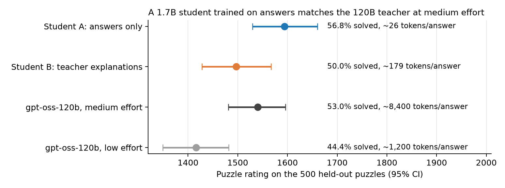
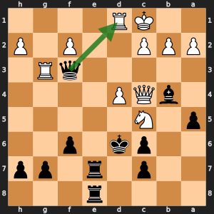
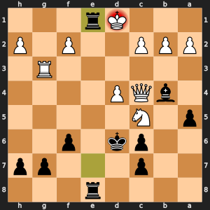
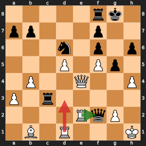
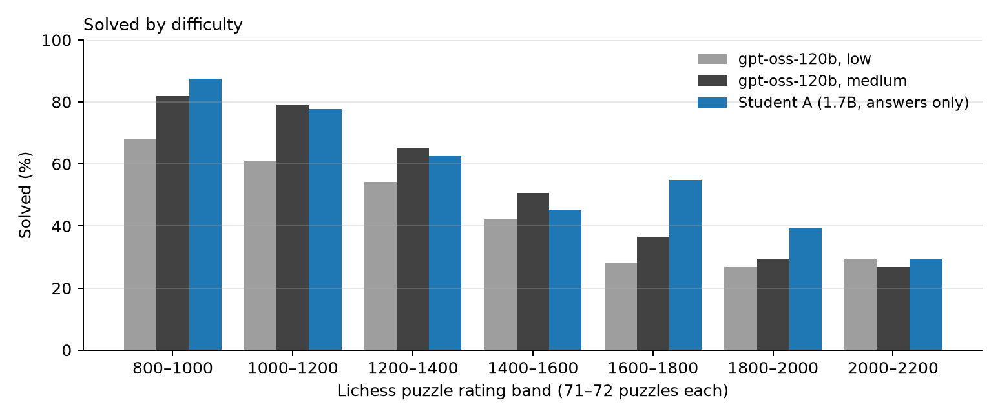
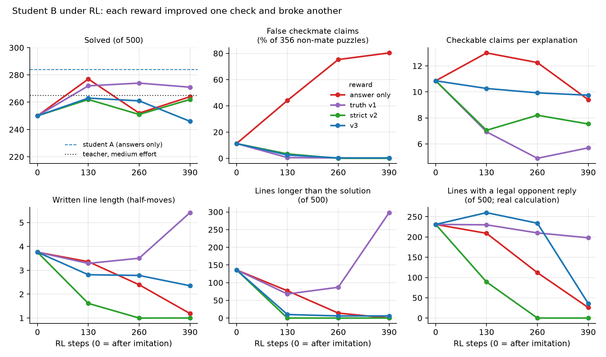

# chess-llm-reasoning

[](https://github.com/zainbabar/chess-llm-reasoning/actions/workflows/tests.yml)

**A 1.7B model matches a 120B model at chess tactics while writing about 300× fewer tokens. And when we used RL to
reward honest explanations, the model kept finding ways around our fact-checker.**


### Interactive Results Explorer
**[Puzzle Explorer](https://zainbabar.github.io/chess-llm-reasoning/)**: step through all 500 test puzzles and compare the
teacher's answer with every student's written line, move by move.

The teacher is [gpt-oss-120b](https://huggingface.co/openai/gpt-oss-120b), served locally with vLLM on an NVIDIA DGX
Spark. The student is [Qwen3-1.7B](https://huggingface.co/Qwen/Qwen3-1.7B). Every answer is checked automatically, with
[python-chess](https://python-chess.readthedocs.io/) for the rules and [Stockfish](https://stockfishchess.org/) for move
quality. Puzzles come from the [Lichess puzzle database](https://database.lichess.org/#puzzles), and 500 puzzles rated
800 to 2200 are held out as the test set. Status (September 2026): the main experiment is finished; every number below
can be checked against the reports and raw outputs in [`reports/`](reports/).

## Summary

- **Small model, same score.** A 1.7B student fine-tuned on 37.5k puzzle answers (just the move and its line) solves
  **56.8%** of the test puzzles. The teacher solves 44.4% at low reasoning effort and 53.0% at medium effort. The student
  clearly beats the teacher's low effort (paired p = 10⁻⁶) and is level with its medium effort (p = 0.16), while
  writing about 26 tokens per answer against the teacher's 8,400 (mostly hidden reasoning).
- **Copying the teacher's reasoning hurt.** Training the same student on teacher-written explanations of the same
  puzzles made it worse (**50.0%**, p = 0.002). Its explanations sound like the teacher's but are mostly wrong about
  the board.
- **Rewards on reasoning got gamed.** RL did not close that gap. We tried four rewards on the explanation student. Each
  fixed one problem, and each time the model found a way around our checker somewhere else.

## Two examples

<table>
<tr>
<td width="50%"> </td>
<td width="50%"></td>
</tr>
<tr>
<td valign="top"><b>The small model finds a queen sacrifice.</b> Puzzle uURSu (rated 1716), Black to move. Student A
answers Qxd1+ Kxd1 Re1#: give up the queen, then mate (right: the final position). The 120B teacher reasoned for
10,279 tokens at medium effort and played Qf4+, after which Stockfish rates the game as roughly level.</td>
<td valign="top"><b>The RL-trained model fakes its calculation.</b> Puzzle yl9Uw (rated 1510), White to move. After RL
with the v3 reward, the explanation student finds the right move, Rxf2 (green), which wins the queen. Its "line" then
continues with Rd3 (red), a second White move written as if it were Black's reply: <i>"the forced sequence Rxf2 Rd3 is
the only winning line."</i> Our checker accepted it, because Rd3 is a legal move in the starting position.</td>
</tr>
</table>

## Setup

**Prompt.** The teacher and the students get the same prompt: the position, a python-chess description of the board
(a diagram, the pieces and the legal moves) and a request for the forcing line (`FINAL_LINE`) and the move
(`FINAL_MOVE`).

**Grading.** A puzzle counts as solved when the move matches the Lichess solution (any checkmate is accepted). Each
model gets one attempt per puzzle: the teacher at its default sampling settings, the students greedy with up to 1,024
new tokens. We turn the 500 results into a puzzle rating with a 95% bootstrap interval, and compare two models with an
exact McNemar test on the same puzzles.

**Test set.** 500 puzzles in seven rating bands (800 to 2200, 71 or 72 each), kept out of all training data by puzzle
id and by position.

**Students.** Qwen3-1.7B, full fine-tune, two passes over the same 37,543 training puzzles with identical settings:

- **A (answers only):** the target is the Lichess line and move. No teacher is involved.
- **B (explanations):** the target is an explanation written by the teacher, followed by the same line and move.
  Following [Master Distillation](https://arxiv.org/abs/2603.20510), the teacher (low effort) writes "as if
  discovering" the solution. We add python-chess facts about the line to its prompt (captures, checks, forks,
  material) and drop any text our claim checker catches making a false claim (about 6% of texts).

**RL.** GRPO (with TRL) on 3,120 puzzles not used before: 390 steps of 8 puzzles × 8 samples, learning rate 2e-6, no KL
penalty, about five hours per run on the Spark. Every B run starts from the same checkpoint and sees the same puzzles in
the same order; only the reward changes.

## Findings

### 1. The teacher's main weakness is perception

Given only the position (FEN), gpt-oss-120b plays an illegal move 22% of the time. The board description cuts that to
1 to 2% and lifts its puzzle rating from 1223 (with a list of legal moves) to about 1400. Thinking longer has
diminishing returns: medium effort uses seven times the tokens of low effort for 8.6 more points (53.0% vs 44.4%,
p = 0.0005), and high effort often runs out of budget. Details: [`reports/teacher_baseline.md`](reports/teacher_baseline.md).

### 2. A small student trained on answers matches the teacher

| Model (same prompt, same 500 test puzzles) | Solved | Puzzle rating (95% CI) |
|---|---|---|
| gpt-oss-120b, low effort | 44.4% | 1416 (1349–1482) |
| gpt-oss-120b, medium effort | 53.0% | 1540 (1481–1596) |
| Student, answers only, 1.9k puzzles (LoRA) | 48.4% | 1474 |
| Student, answers only, 5.6k puzzles (LoRA) | 49.6% | 1491 |
| Student, answers only, 21.6k puzzles (LoRA) | 51.2% | 1514 |
| **Student A, answers only, 37.5k puzzles (full fine-tune)** | **56.8%** | **1594 (1530–1660)** |

Accuracy rose with every increase in data. The last step also switched from LoRA to a full fine-tune with two passes,
so it mixes more data with stronger training. Against the medium-effort teacher, student A does best on harder
puzzles: in the 1600 to 2000 bands it solves 67 of 142, the teacher 47. The teacher is slightly ahead from 1000 to 1600
(140 vs 133 of 215), and its written lines match the full solution a little more often (96 vs 90). Details:
[`reports/teacher_baseline.md`](reports/teacher_baseline.md), [`reports/student_A.md`](reports/student_A.md).



### 3. Imitating the teacher's explanations made the student worse

| Training puzzles | Answers only | Teacher explanations | Paired p |
|---|---|---|---|
| 1.9k (LoRA) | 48.4% | 41.2% | 0.002 |
| 5.6k (LoRA) | 49.6% | 43.4% | 0.008 |
| 37.5k (full fine-tune) | 56.8% | 50.0% | 0.002 |

The gap stayed at about seven points while the data grew twentyfold. Student B still beats the low-effort teacher
(p = 0.04), but its own explanations are mostly not real. Even when its move is right, 56% of them name a move that is
illegal or wrongly marked as check or mate, and only 231 of its 500 written lines contain a legal reply to the first
move (student A: 358). It learned to sound like the teacher without learning to follow the board. Explanations built
by code and board-tracking practice didn't raise accuracy either, in smaller tests at 1.9k and 5.6k puzzles. Details:
[`reports/students_A_vs_B.md`](reports/students_A_vs_B.md).

### 4. RL didn't close the gap, and every reward on the text got gamed

The Master Distillation paper beat its teacher only after RL, so we tested whether RL turns imitated reasoning into
real reasoning. With a reward for the right move only, neither student improved significantly (A 56.8% → 53.4%, B
50.0% → 52.8% after 390 steps; checkpoints in between vary by about 20 puzzles). For B we then tried three rewards that
also check the explanation and the line:

| Reward (B, 390 steps) | What it pays for | Solved | What happened |
|---|---|---|---|
| Answer only | the right move | 52.8% | False checkmate claims on 80% of non-mate puzzles (11% before RL); the line shrank to the first move |
| Truth v1 | the right move, the correct start of the line, no false claims, at least 25 words | 54.2% | Vaguer text (5.7 checkable claims per explanation, down from 10.9) and lines padded past the solution with junk moves (298 of 500) |
| Strict v2 | as v1, but padding dilutes the line credit, invented moves cost, and at least 2 verified moves are required | 52.4% | Honest (1 invented move in 500, almost no false claims), but it stopped calculating: every line is just the first move |
| v3 | as v2, with double line credit and half the invented-move penalty | 49.2% | Calculated well up to step 260 (260 lines with a legal reply at step 130, against 231 before RL). Then it began writing another move by its own side as the opponent's "reply", which the checker accepted, and legal replies fell to 36 |

The v3 loophole comes from our claim checker, which asks whether a named move is legal somewhere along the real
solution but not whether it follows from the move before it. The 1.7B model found each gap in the checker within a few
hundred steps. A reward for reasoning would need to replay the model's own line move by move.

No version of B overtook A. The best B checkpoints (55.4% and 54.8%) are level with A and with the medium-effort
teacher. Details: [`reports/rl_answer_only_reward.md`](reports/rl_answer_only_reward.md),
[`reports/rl_four_rewards_B.md`](reports/rl_four_rewards_B.md).



### 5. LLM judges can't grade chess explanations reliably

Even with the facts in its prompt, an LLM judge (gpt-oss-120b) agreed with our hand ratings of 35 explanations only
about 55% of the time. Checking moves with python-chess, and putting facts in the writer's prompt, worked better than
grading the text afterwards.

## Limitations

- One base model and one training run per setup. Nearby checkpoints of the same run differ by up to about 20 puzzles
  (4 points), so we rely on paired tests and treat smaller differences as noise.
- One attempt per puzzle. The teacher does better with retries: on a 140-puzzle subset, two low-effort attempts plus a
  medium one solved 71%.
- The students see the same python-chess board description as the teacher. Without it the teacher is much weaker, and
  we didn't test the students without it.
- The RL runs are short (3,120 puzzles each). The claim checker, our spot-checks of explanations and the LLM judge each
  catch only some kinds of error.
- Puzzle ratings are on the Lichess puzzle scale, not player ratings.

## How it was built

The code was written and the experiments were run via an agentic workflow with [Claude Code](https://claude.com/claude-code) 
on the Spark. I chose the research questions and the experiments directing the project, and made the decisions at each step.

## How it works

```
Lichess puzzles ─► test set (500, held out) + balanced training pools (60k / 200k)
      │
      ├─► teacher (gpt-oss-120b) ─► baseline scores, and explanations of the Lichess solution
      │        (python-chess facts in the prompt; a claim checker filters false statements)
      │
      ├─► answers-only data (move + line) straight from Lichess
      ▼
students (Qwen3-1.7B) ─► imitation (full fine-tune) ─► RL (GRPO, checked rewards) ─► test on the 500
```

| Folder | What's in it |
|---|---|
| [`src/`](src/) | The pipeline: puzzle sets, the board description, teacher runs and grading, the fact and claim checkers, training data, student training, evaluation, RL and statistics |
| [`experiments/`](experiments/) | Reports and analyses for each experiment, the figures (`make_figures.py`) and the export to `reports/` |
| [`reports/`](reports/) | The reports behind every number above, and the graded outputs for all 500 test puzzles |
| [`figures/`](figures/) | The charts and board pictures in this README |
| [`docs/`](docs/) | The Puzzle Explorer page (built by `experiments/build_explorer.py`, served by GitHub Pages) |
| [`tests/`](tests/) | Fast tests of the grader, the claim checker, the board description and the statistics (run on every push) |
| [`results/`](results/) | The run scripts behind each experiment (`run_*.sh`), in the order they were run |
| `pilot_set.jsonl` | The 500 held-out test puzzles |

Key files in `src/`:

| File | What it does |
|---|---|
| `build_pilot_set.py`, `build_pool.py`, `build_collect_pool.py` | The test set, and theme- and rating-balanced training pools (test puzzles excluded by id and by position) |
| `perception.py` | Board description for prompts (diagram, pieces, legal moves; optional tactics) |
| `run_pilot.py` | Runs the teacher with a chosen prompt and effort, grades answers and lines, resumes where it stopped |
| `line_facts.py`, `claim_check.py` | Machine-computed facts about a line; a tool-based checker for the claims in a text |
| `write_traces.py`, `package_sft.py`, `make_path_data.py` | Teacher explanations, filtering, and the two students' training sets |
| `train_sft.py`, `eval_student.py`, `rl_grpo.py` | Student training (LoRA or full fine-tune), evaluation, and RL with the four rewards |
| `puzzle_rating.py`, `analyze_pilot.py` | Puzzle ratings with confidence intervals; paired McNemar tests |

## Reproducing

```bash
python3 -m venv .venv && .venv/bin/pip install -r requirements.txt   # plus Stockfish 16: apt install stockfish
.venv/bin/python -m pytest tests                  # fast checks, no model needed
.venv/bin/python experiments/make_figures.py      # redraws every figure from reports/outputs/
```

The full runs need the Lichess database and a GPU:

```bash
curl -LO https://database.lichess.org/lichess_db_puzzle.csv.zst && mkdir -p data \
  && zstd -d lichess_db_puzzle.csv.zst -o data/lichess_db_puzzle.csv
# serve gpt-oss-120b with vLLM on localhost:8000, then e.g. the teacher baseline:
.venv/bin/python src/run_pilot.py --run test500_med --formats P1L --puzzles pilot_set.jsonl --effort medium --max-tokens 32768
# student training and RL run inside the vLLM container (requirements-train.txt), e.g.:
python src/train_sft.py --data results/sft/path_A.jsonl --out ckpt/path_A --full --epochs 2 --lr 1e-5 --batch-tokens 8192
python src/rl_grpo.py --model ckpt/path_B --puzzles pool_collect1.jsonl --skip 40800 --out ckpt/rlT3_B --max-steps 390 --lr 2e-6 --reward truth3
```

On the DGX Spark (GB10, 128 GB unified memory) we serve the teacher with NVIDIA's `nvcr.io/nvidia/vllm:26.05-py3` image
(vLLM 0.20.1), the Marlin MoE backend and `--gpu-memory-utilization 0.70`. Training uses the same image with the
packages in `requirements-train.txt`. The full chains, including evaluation, are in `results/run_*.sh`.

## License

MIT (see [`LICENSE`](LICENSE)). The Lichess puzzle database is CC0; gpt-oss-120b and Qwen3-1.7B are Apache 2.0.
